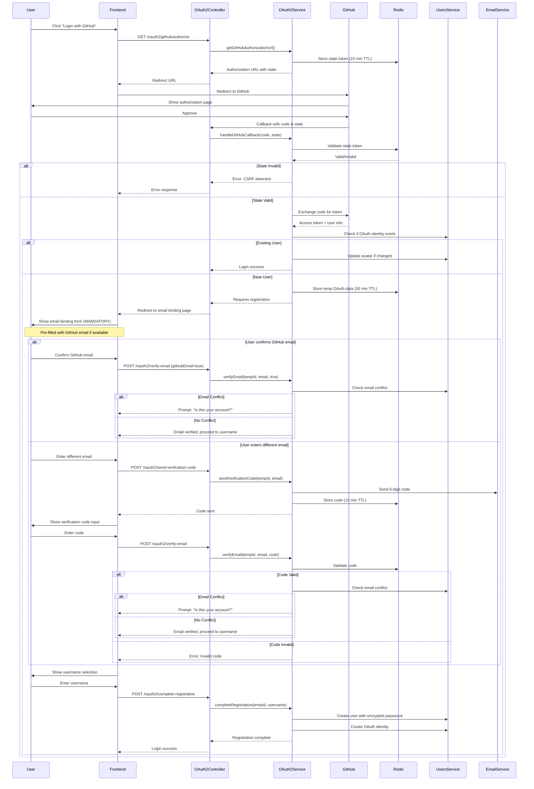

# Design Document: OAuth2 Enhancement (Simplified)

## Overview

This design document outlines a simplified enhancement of the OAuth2 login and registration system for the Java Spring Boot application. The enhancements focus on:

1. **Optional email binding** during OAuth2 registration (skippable)
2. **Username selection** instead of auto-generation
3. **Encrypted default passwords** for OAuth2 users
4. **State parameter validation** for CSRF protection
5. **Account merging** when OAuth2 email matches existing account

**Key Design Principles:**
- **No database schema changes** - Use existing Users and OauthIdentities tables
- **Minimal new services** - Enhance existing OAuth2ServiceImpl instead of creating many new services
- **Leverage existing infrastructure** - Use existing UsersService, Redis, and utilities

## Architecture

### Simplified Architecture

```
┌─────────────────────────────────────────────────────────────┐
│                      OAuth2Controller                        │
│  - GET /oauth2/github/authorize                             │
│  - GET /oauth2/github/callback                              │
│  - POST /oauth2/complete-registration                       │
└──────────────────────┬──────────────────────────────────────┘
                       │
                       ▼
┌─────────────────────────────────────────────────────────────┐
│              OAuth2ServiceImpl (Enhanced)                    │
│  - State validation (Redis)                                 │
│  - Email binding flow                                       │
│  - Username selection                                       │
│  - Account merging                                          │
│  - Default password generation                              │
└──────────────────────┬──────────────────────────────────────┘
                       │
         ┌─────────────┼─────────────┐
         ▼             ▼             ▼
┌────────────┐  ┌──────────────┐  ┌──────────────┐
│ UsersService│  │OauthIdentities│  │ Redis Cache  │
│  (existing) │  │Service        │  │ (state,temp) │
│             │  │  (existing)   │  │              │
└────────────┘  └──────────────┘  └──────────────┘
```

### Registration Flow (Simplified)



## Implementation Details

### 1. State Validation (CSRF Protection)

**Location:** OAuth2ServiceImpl

**Redis Key Structure:**
```
Key: oauth2:state:{state_token}
Value: {"createdAt": 1234567890}
TTL: 600 seconds (10 minutes)
```

**Methods to Add:**
```java
// Generate and store state
private String generateAndStoreState() {
    String state = UUID.randomUUID().toString();
    // Store in Redis with 10-minute TTL
    redisTemplate.opsForValue().set(
        "oauth2:state:" + state, 
        System.currentTimeMillis(), 
        10, 
        TimeUnit.MINUTES
    );
    return state;
}

// Validate and remove state
private boolean validateAndRemoveState(String state) {
    String key = "oauth2:state:" + state;
    Long createdAt = (Long) redisTemplate.opsForValue().get(key);
    if (createdAt == null) {
        log.warn("Invalid or expired state parameter: {}", state);
        return false;
    }
    redisTemplate.delete(key);
    return true;
}
```

### 2. Temporary OAuth Data Storage

**Redis Key Structure:**
```
Key: oauth2:temp:{tempUserId}
Value: {
    "provider": "github",
    "identifier": "12345",
    "username": "johndoe",
    "nickname": "John Doe",
    "email": "john@example.com",  // May be null
    "emailVerified": "true",  // true if from GitHub verified email
    "avatarUrl": "https://...",
    "accessToken": "..."
}
TTL: 1800 seconds (30 minutes)
```

**Email Verification Code Storage:**
```
Key: oauth2:verify:{tempUserId}
Value: {"code": "123456", "email": "user@example.com", "createdAt": 1234567890}
TTL: 600 seconds (10 minutes)
```

**Methods to Add:**
```java
// Store temporary OAuth data
private String storeTempOAuthData(OAuth2UserInfo userInfo) {
    String tempUserId = UUID.randomUUID().toString();
    String key = "oauth2:temp:" + tempUserId;
    
    Map<String, String> data = new HashMap<>();
    data.put("provider", "github");
    data.put("identifier", userInfo.getIdentifier());
    data.put("username", userInfo.getUsername());
    data.put("nickname", userInfo.getNickname());
    data.put("email", userInfo.getEmail());  // May be null
    data.put("emailVerified", userInfo.getEmail() != null ? "true" : "false");  // GitHub emails are verified
    data.put("avatarUrl", userInfo.getAvatarUrl());
    data.put("accessToken", userInfo.getAccessToken());
    
    redisTemplate.opsForHash().putAll(key, data);
    redisTemplate.expire(key, 30, TimeUnit.MINUTES);
    
    return tempUserId;
}

// Retrieve temporary OAuth data
private Map<String, String> getTempOAuthData(String tempUserId) {
    String key = "oauth2:temp:" + tempUserId;
    Map<Object, Object> rawData = redisTemplate.opsForHash().entries(key);
    
    if (rawData.isEmpty()) {
        throw new BusinessException(ResultCode.OAUTH_TEMP_DATA_EXPIRED);
    }
    
    Map<String, String> data = new HashMap<>();
    rawData.forEach((k, v) -> data.put(k.toString(), v != null ? v.toString() : null));
    
    return data;
}

// Send email verification code
public Result<Void> sendVerificationCode(String tempUserId, String email) {
    Assert.hasText(tempUserId, "临时用户ID不能为空");
    Assert.hasText(email, "邮箱不能为空");
    
    // Validate email format
    if (!isValidEmail(email)) {
        return Result.error(ResultCode.EMAIL_FORMAT_INVALID, "邮箱格式不正确");
    }
    
    // Generate 6-digit code
    String code = String.format("%06d", new Random().nextInt(999999));
    
    // Store in Redis
    String key = "oauth2:verify:" + tempUserId;
    Map<String, String> verifyData = new HashMap<>();
    verifyData.put("code", code);
    verifyData.put("email", email);
    verifyData.put("createdAt", String.valueOf(System.currentTimeMillis()));
    
    redisTemplate.opsForHash().putAll(key, verifyData);
    redisTemplate.expire(key, 10, TimeUnit.MINUTES);
    
    // Send email (use existing email service)
    try {
        emailService.sendVerificationCode(email, code);
        log.info("发送邮箱验证码成功: tempUserId={}, email={}", tempUserId, email);
        return Result.success("验证码已发送");
    } catch (Exception e) {
        log.error("发送邮箱验证码失败", e);
        return Result.error(ResultCode.EMAIL_SEND_FAILED, "验证码发送失败");
    }
}

// Verify email with code
public Result<Void> verifyEmailWithCode(String tempUserId, String email, String code) {
    Assert.hasText(tempUserId, "临时用户ID不能为空");
    Assert.hasText(email, "邮箱不能为空");
    Assert.hasText(code, "验证码不能为空");
    
    // Get stored verification data
    String key = "oauth2:verify:" + tempUserId;
    Map<Object, Object> rawData = redisTemplate.opsForHash().entries(key);
    
    if (rawData.isEmpty()) {
        return Result.error(ResultCode.VERIFICATION_CODE_EXPIRED, "验证码已过期");
    }
    
    String storedCode = (String) rawData.get("code");
    String storedEmail = (String) rawData.get("email");
    
    // Validate code and email match
    if (!code.equals(storedCode) || !email.equals(storedEmail)) {
        return Result.error(ResultCode.VERIFICATION_CODE_INVALID, "验证码不正确");
    }
    
    // Update temp data to mark email as verified
    String tempKey = "oauth2:temp:" + tempUserId;
    redisTemplate.opsForHash().put(tempKey, "email", email);
    redisTemplate.opsForHash().put(tempKey, "emailVerified", "true");
    
    // Delete verification code
    redisTemplate.delete(key);
    
    log.info("邮箱验证成功: tempUserId={}, email={}", tempUserId, email);
    return Result.success("邮箱验证成功");
}

// Verify GitHub email (no code needed)
public Result<Void> verifyGitHubEmail(String tempUserId) {
    Assert.hasText(tempUserId, "临时用户ID不能为空");
    
    // Get temp data
    Map<String, String> tempData = getTempOAuthData(tempUserId);
    String email = tempData.get("email");
    
    if (email == null || email.trim().isEmpty()) {
        return Result.error(ResultCode.EMAIL_NOT_PROVIDED, "GitHub 未提供邮箱");
    }
    
    // GitHub emails are already verified, just mark as confirmed
    String tempKey = "oauth2:temp:" + tempUserId;
    redisTemplate.opsForHash().put(tempKey, "emailVerified", "true");
    
    log.info("确认 GitHub 邮箱: tempUserId={}, email={}", tempUserId, email);
    return Result.success("邮箱确认成功");
}
```

### 3. Enhanced Registration Flow

**Modified handleGitHubCallback:**
```java
@Override
@Transactional(rollbackFor = Exception.class)
public Result<LoginResponse> handleGitHubCallback(String code, String state, Boolean rememberMe) {
    Assert.hasText(code, "授权码不能为空");
    Assert.hasText(state, "State 参数不能为空");
    
    // 1. Validate state parameter (CSRF protection)
    if (!validateAndRemoveState(state)) {
        log.error("Invalid state parameter, possible CSRF attack");
        return Result.error(ResultCode.OAUTH_STATE_INVALID, "安全验证失败，请重试");
    }
    
    // 2. Get GitHub user info
    OAuth2UserInfo userInfo = getGitHubUserInfo(code);
    Assert.notNull(userInfo, "获取 GitHub 用户信息失败");
    Assert.hasText(userInfo.getIdentifier(), "GitHub 用户标识为空");
    
    // 3. Check if OAuth identity exists
    OauthIdentities oauthIdentity = oauthIdentitiesService.getByProviderAndIdentifier("github", userInfo.getIdentifier());
    
    if (oauthIdentity != null) {
        // Existing user - direct login
        Users user = usersService.getById(oauthIdentity.getUserId());
        Assert.notNull(user, ResultCode.USER_NOT_FOUND);
        Assert.isTrue(user.getStatus() == 1, ResultCode.USER_DISABLED);
        
        // Update OAuth credential
        oauthIdentitiesService.createOrUpdate(user.getId(), "github", userInfo.getIdentifier(), userInfo.getAccessToken());
        
        // Update avatar if changed
        updateAvatarIfChanged(user, userInfo.getAvatarUrl());
        
        // Login
        boolean remember = Boolean.TRUE.equals(rememberMe);
        StpUtil.login(user.getId(), remember ? 14 * 24 * 60 * 60 : 6 * 60 * 60);
        
        LoginResponse loginResponse = UserConverter.toLoginResponse(user, remember);
        return Result.success("GitHub 登录成功", loginResponse);
        
    } else {
        // New user - requires registration flow
        String tempUserId = storeTempOAuthData(userInfo);
        
        // Return response indicating registration is needed
        Map<String, Object> response = new HashMap<>();
        response.put("requiresRegistration", true);
        response.put("tempUserId", tempUserId);
        response.put("suggestedEmail", userInfo.getEmail());  // May be null
        response.put("suggestedUsername", userInfo.getUsername());
        
        return Result.success("需要完成注册", response);
    }
}
```

**New Method: completeOAuth2Registration:**
```java
@Transactional(rollbackFor = Exception.class)
public Result<LoginResponse> completeOAuth2Registration(String tempUserId, String username, Boolean rememberMe) {
    Assert.hasText(tempUserId, "临时用户ID不能为空");
    Assert.hasText(username, "用户名不能为空");
    
    // 1. Retrieve temp OAuth data
    Map<String, String> oauthData = getTempOAuthData(tempUserId);
    
    // 2. Verify email has been verified
    String emailVerified = oauthData.get("emailVerified");
    if (!"true".equals(emailVerified)) {
        return Result.error(ResultCode.EMAIL_NOT_VERIFIED, "请先验证邮箱");
    }
    
    String email = oauthData.get("email");
    Assert.hasText(email, "邮箱不能为空");
    
    // 3. Validate username
    if (!usersService.isUsernameAvailable(username, null)) {
        return Result.error(ResultCode.USERNAME_ALREADY_EXISTS, "用户名已存在");
    }
    
    // 4. Check email conflict
    if (!usersService.isEmailAvailable(email, null)) {
        // Email exists - potential account merge
        return Result.error(ResultCode.EMAIL_ALREADY_EXISTS, "邮箱已被使用，是否为您的现有账号？");
    }
    
    // 5. Generate encrypted default password
    String defaultPassword = generateSecurePassword();
    String encryptedPassword = BCrypt.hashpw(defaultPassword, BCrypt.gensalt());
    
    // 6. Create user
    RegisterRequest registerRequest = new RegisterRequest();
    registerRequest.setUsername(username);
    registerRequest.setPassword(encryptedPassword);  // Already encrypted
    registerRequest.setEmail(email);
    registerRequest.setNickname(oauthData.get("nickname"));
    registerRequest.setRememberMe(false);
    
    Result<LoginResponse> registerResult = usersService.register(registerRequest);
    if (registerResult.getCode() != 200) {
        return registerResult;
    }
    
    // 7. Get created user
    Users user = usersService.getUserByUsername(username);
    Assert.notNull(user, "注册后获取用户失败");
    
    // 8. Update avatar
    String avatarUrl = oauthData.get("avatarUrl");
    if (avatarUrl != null && !avatarUrl.trim().isEmpty()) {
        user.setAvatarUrl(avatarUrl);
        usersService.updateById(user);
    }
    
    // 9. Create OAuth identity
    oauthIdentitiesService.createOrUpdate(
        user.getId(), 
        oauthData.get("provider"), 
        oauthData.get("identifier"), 
        oauthData.get("accessToken")
    );
    
    // 10. Clean up temp data
    redisTemplate.delete("oauth2:temp:" + tempUserId);
    redisTemplate.delete("oauth2:verify:" + tempUserId);
    
    // 11. Login
    boolean remember = Boolean.TRUE.equals(rememberMe);
    StpUtil.login(user.getId(), remember ? 14 * 24 * 60 * 60 : 6 * 60 * 60);
    
    LoginResponse loginResponse = UserConverter.toLoginResponse(user, remember);
    return Result.success("注册并登录成功", loginResponse);
}

// Helper: Generate secure random password
private String generateSecurePassword() {
    return UUID.randomUUID().toString() + UUID.randomUUID().toString();
}

// Helper: Validate email format
private boolean isValidEmail(String email) {
    String emailRegex = "^[A-Za-z0-9+_.-]+@[A-Za-z0-9.-]+\\.[A-Za-z]{2,}$";
    return email != null && email.matches(emailRegex);
}

// Helper: Update avatar if changed
private void updateAvatarIfChanged(Users user, String newAvatarUrl) {
    if (newAvatarUrl != null && !newAvatarUrl.trim().isEmpty()) {
        if (!newAvatarUrl.equals(user.getAvatarUrl())) {
            user.setAvatarUrl(newAvatarUrl);
            usersService.updateById(user);
            log.info("更新用户头像: userId={}, avatarUrl={}", user.getId(), newAvatarUrl);
        }
    }
}
```

### 4. Account Merging Flow

**New Method: initiateAccountMerge:**
```java
public Result<Map<String, Object>> initiateAccountMerge(String tempUserId, String email) {
    Assert.hasText(tempUserId, "临时用户ID不能为空");
    Assert.hasText(email, "邮箱不能为空");
    
    // 1. Check if email exists
    Users existingUser = usersService.getUserByEmail(email);
    if (existingUser == null) {
        return Result.error(ResultCode.USER_NOT_FOUND, "该邮箱未注册");
    }
    
    // 2. Return merge options
    Map<String, Object> response = new HashMap<>();
    response.put("requiresMerge", true);
    response.put("existingUserId", existingUser.getId());
    response.put("existingUsername", existingUser.getUsername());
    response.put("message", "检测到该邮箱已注册，请通过账号恢复流程验证身份后合并账号");
    
    return Result.success("需要账号合并", response);
}

@Transactional(rollbackFor = Exception.class)
public Result<LoginResponse> completeAccountMerge(String tempUserId, Long existingUserId, Boolean rememberMe) {
    Assert.hasText(tempUserId, "临时用户ID不能为空");
    Assert.notNull(existingUserId, "现有用户ID不能为空");
    
    // 1. Retrieve temp OAuth data
    Map<String, String> oauthData = getTempOAuthData(tempUserId);
    
    // 2. Verify existing user
    Users existingUser = usersService.getById(existingUserId);
    Assert.notNull(existingUser, ResultCode.USER_NOT_FOUND);
    Assert.isTrue(existingUser.getStatus() == 1, ResultCode.USER_DISABLED);
    
    // 3. Check if OAuth identity already linked to another user
    OauthIdentities existingIdentity = oauthIdentitiesService.getByProviderAndIdentifier(
        oauthData.get("provider"), 
        oauthData.get("identifier")
    );
    
    if (existingIdentity != null && !existingIdentity.getUserId().equals(existingUserId)) {
        return Result.error(ResultCode.OAUTH_ALREADY_LINKED, "该 OAuth 账号已绑定到其他用户");
    }
    
    // 4. Create or update OAuth identity
    oauthIdentitiesService.createOrUpdate(
        existingUserId, 
        oauthData.get("provider"), 
        oauthData.get("identifier"), 
        oauthData.get("accessToken")
    );
    
    // 5. Update avatar if user hasn't set custom avatar
    String avatarUrl = oauthData.get("avatarUrl");
    if (avatarUrl != null && !avatarUrl.trim().isEmpty()) {
        // Only update if current avatar is default or empty
        if (existingUser.getAvatarUrl() == null || existingUser.getAvatarUrl().trim().isEmpty()) {
            existingUser.setAvatarUrl(avatarUrl);
            usersService.updateById(existingUser);
        }
    }
    
    // 6. Clean up temp data
    redisTemplate.delete("oauth2:temp:" + tempUserId);
    
    // 7. Login
    boolean remember = Boolean.TRUE.equals(rememberMe);
    StpUtil.login(existingUserId, remember ? 14 * 24 * 60 * 60 : 6 * 60 * 60);
    
    LoginResponse loginResponse = UserConverter.toLoginResponse(existingUser, remember);
    return Result.success("账号合并成功", loginResponse);
}
```

## Controller Endpoints

### OAuth2Controller (Enhanced)

```java
@RestController
@RequestMapping("/oauth2")
@RequiredArgsConstructor
public class OAuth2Controller {
    
    private final OAuth2Service oauth2Service;
    
    /**
     * 获取 GitHub 授权 URL (with state validation)
     */
    @GetMapping("/github/authorize")
    public Result<String> getGitHubAuthorizationUrl() {
        String authUrl = oauth2Service.getGitHubAuthorizationUrl(null);  // Service generates state
        return Result.success("获取授权 URL 成功", authUrl);
    }
    
    /**
     * GitHub OAuth2 回调 (with state validation)
     */
    @GetMapping("/github/callback")
    public Result<LoginResponse> handleGitHubCallback(
            @RequestParam String code,
            @RequestParam String state,
            @RequestParam(required = false, defaultValue = "false") Boolean rememberMe) {
        return oauth2Service.handleGitHubCallback(code, state, rememberMe);
    }
    
    /**
     * 发送邮箱验证码
     */
    @PostMapping("/send-verification-code")
    public Result<Void> sendVerificationCode(
            @RequestParam String tempUserId,
            @RequestParam String email) {
        return oauth2Service.sendVerificationCode(tempUserId, email);
    }
    
    /**
     * 验证邮箱（使用验证码）
     */
    @PostMapping("/verify-email")
    public Result<Void> verifyEmail(
            @RequestParam String tempUserId,
            @RequestParam String email,
            @RequestParam(required = false) String code,
            @RequestParam(required = false, defaultValue = "false") Boolean isGitHubEmail) {
        
        if (Boolean.TRUE.equals(isGitHubEmail)) {
            // GitHub email - no code needed
            return oauth2Service.verifyGitHubEmail(tempUserId);
        } else {
            // Custom email - requires code
            return oauth2Service.verifyEmailWithCode(tempUserId, email, code);
        }
    }
    
    /**
     * 完成 OAuth2 注册（用户名选择）
     */
    @PostMapping("/complete-registration")
    public Result<LoginResponse> completeRegistration(
            @RequestParam String tempUserId,
            @RequestParam String username,
            @RequestParam(required = false, defaultValue = "false") Boolean rememberMe) {
        return oauth2Service.completeOAuth2Registration(tempUserId, username, rememberMe);
    }
    
    /**
     * 发起账号合并
     */
    @PostMapping("/initiate-merge")
    public Result<Map<String, Object>> initiateMerge(
            @RequestParam String tempUserId,
            @RequestParam String email) {
        return oauth2Service.initiateAccountMerge(tempUserId, email);
    }
    
    /**
     * 完成账号合并（在用户通过账号恢复验证后）
     */
    @PostMapping("/complete-merge")
    public Result<LoginResponse> completeMerge(
            @RequestParam String tempUserId,
            @RequestParam Long existingUserId,
            @RequestParam(required = false, defaultValue = "false") Boolean rememberMe) {
        return oauth2Service.completeAccountMerge(tempUserId, existingUserId, rememberMe);
    }
}
```

## Frontend Flow

### 1. Email Binding Page (MANDATORY)

**URL:** `/oauth2/email-binding?tempUserId={tempUserId}`

**UI Components:**

**Case 1: GitHub provides verified email**
- Display: "GitHub 已验证邮箱: user@example.com"
- Show "确认使用此邮箱" button
- Show "使用其他邮箱" link
- If user clicks "确认":
  - Call `/oauth2/verify-email?tempUserId={id}&email={email}&isGitHubEmail=true`
  - Proceed to username selection
- If user clicks "使用其他邮箱":
  - Show email input field

**Case 2: GitHub doesn't provide email OR user wants different email**
- Email input field
- "发送验证码" button
- After clicking "发送验证码":
  - Call `/oauth2/send-verification-code`
  - Show 6-digit code input field
  - Show "重新发送" link (enabled after 60 seconds)
  - Show "验证" button
- After entering code:
  - Call `/oauth2/verify-email?tempUserId={id}&email={email}&code={code}`
  - If success, proceed to username selection
  - If error, show error message and allow retry

**Conflict Resolution:**
- If email exists, show dialog: "该邮箱已注册，是否为您的现有账号？"
- Options:
  - "是，这是我的账号" → Redirect to account recovery
  - "不是，使用其他邮箱" → Clear input and ask for different email

### 2. Username Selection Page

**URL:** `/oauth2/username-selection?tempUserId={tempUserId}`

**UI Components:**
- Suggested username (from GitHub) displayed as placeholder
- Username input with real-time validation
- Format requirements display (3-32 chars, alphanumeric + _-)
- Availability indicator (✓ available / ✗ taken)
- "完成注册" button
- On submit:
  - Call `/oauth2/complete-registration?tempUserId={id}&username={username}`
  - Handle success → Login
  - Handle error → Show error message

### 3. Account Merge Flow

**Trigger:** When email conflict detected during verification

**Steps:**
1. Show dialog: "该邮箱已注册，是否为您的现有账号？"
2. If "是" → Redirect to account recovery page
3. After recovery verification → Call `/oauth2/complete-merge`
4. If "否" → Ask for different email

## Error Codes

Add to ResultCode enum:

```java
OAUTH_STATE_INVALID(4001, "OAuth2 state 参数无效"),
OAUTH_TEMP_DATA_EXPIRED(4002, "OAuth2 临时数据已过期，请重新登录"),
OAUTH_ALREADY_LINKED(4003, "该 OAuth 账号已绑定到其他用户"),
EMAIL_FORMAT_INVALID(4004, "邮箱格式不正确"),
EMAIL_NOT_VERIFIED(4005, "邮箱未验证"),
EMAIL_NOT_PROVIDED(4006, "GitHub 未提供邮箱"),
VERIFICATION_CODE_EXPIRED(4007, "验证码已过期"),
VERIFICATION_CODE_INVALID(4008, "验证码不正确"),
EMAIL_SEND_FAILED(4009, "验证码发送失败"),
```

## Configuration

### application.yml

```yaml
spring:
  redis:
    host: localhost
    port: 6379
    database: 0
    timeout: 3000ms
    
oauth2:
  github:
    client-id: ${GITHUB_CLIENT_ID}
    client-secret: ${GITHUB_CLIENT_SECRET}
    redirect-uri: ${GITHUB_REDIRECT_URI}
  
  state:
    ttl-minutes: 10
  temp-data:
    ttl-minutes: 30
```

## Testing Strategy

### Unit Tests

1. **State Validation Tests**
   - Test state generation and storage
   - Test state validation success
   - Test expired state rejection
   - Test invalid state rejection

2. **Registration Flow Tests**
   - Test new user registration with email
   - Test new user registration without email
   - Test username uniqueness validation
   - Test email format validation

3. **Account Merge Tests**
   - Test merge detection
   - Test merge completion
   - Test OAuth identity linking

### Integration Tests

1. **End-to-End OAuth2 Flow**
   - Mock GitHub OAuth2 provider
   - Test complete registration flow
   - Test account merge flow
   - Test existing user login

## Security Considerations

1. **CSRF Protection:** State parameter validation prevents CSRF attacks
2. **Password Security:** Default passwords are BCrypt encrypted
3. **Data Expiration:** Temporary OAuth data expires after 30 minutes
4. **State Expiration:** State tokens expire after 10 minutes
5. **Transaction Safety:** All multi-step operations use @Transactional

## Summary

This simplified design:
- ✅ No database schema changes
- ✅ Minimal new code (enhance existing OAuth2ServiceImpl)
- ✅ Uses existing infrastructure (Redis, UsersService)
- ✅ Implements all core requirements
- ✅ Maintains security best practices
